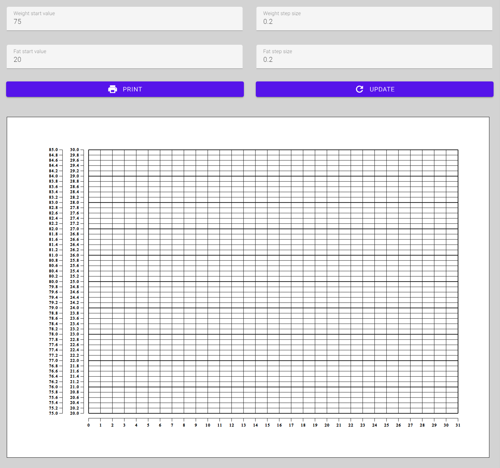

# weight-template-generator

This creates a graph to print out on a DIN A4 paper.

## Motivation

1. Playing a little bit with embedded SVG.
2. Control my weight during lockdown in a simple way...

## Develop / Run

NodeJs is required (https://nodejs.org/)

run

    npm install

then run

    npm run develop

and open a Browser of your choice @ http://localhost:3000

BrowserSync watches file changes in 'src' directory and reload the browser content. 
